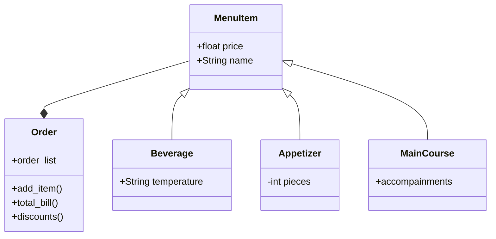

# reto_3
## Ejercicio en Clase
```
```
## Escenario: Restaurante
```

```
### Diagrama de Clases

```mermaid
classDiagram
    MenuItem --* Order
    
    MenuItem <|-- Beverage
    MenuItem <|-- Appetizer
    MenuItem <|-- MainCourse

    class MenuItem{
    +float price
    +String name}

    class Beverage{
      +String temperature
 
    }
    class Appetizer{
      -int pieces
    }
    class MainCourse{
      +accompainments
 
    }
    class Order{
    +order_list
    +add_item()
    +total_bill()
    +discounts()}
```


