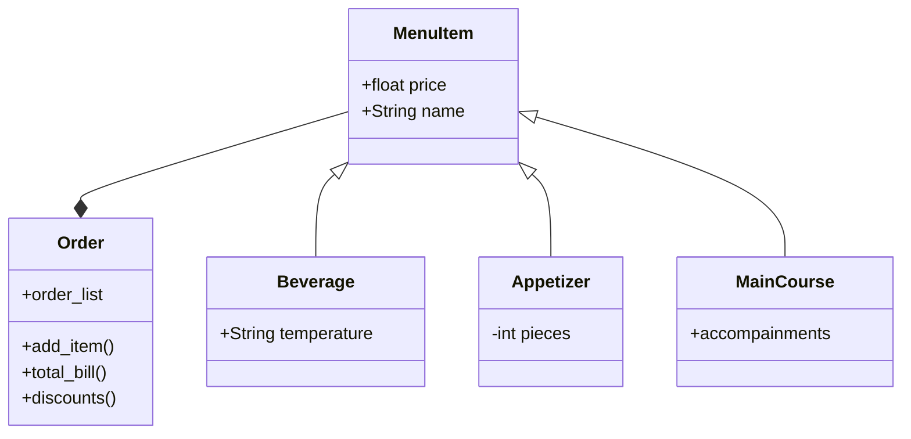

# reto_3
## Ejercicio en Clase
```
class Point :
    def __init__(self,x,y):
        self.x=x
        self.y=y

class Line:
    def __init__(self,start:Point,end:Point): # parametro.Clase

        
        self.start=start
        self.end=end
        self.lenght=self.compute_lenght()
        self.slope=self.compute_slope()
        

    def compute_lenght(self):

        self.a=(self.end.x-self.start.x)
        self.b=(self.end.y-self.start.y)
        self.lenght=((self.a**2+self.b**2)**0.5)
        return (self.lenght)
    
    def compute_slope(self):

        if (self.end.x - self.start.x) == 0:
            return float('inf')
        else:
            self.slope=(self.b/self.a)
            return (self.slope)
    
    def compute_horizontal_cross(self):

        if self.start.y<0 and self.end.y>0:
            cross_point=Point(((0- self.start.y)/self.slope)+self.start.x , 0) # y = 0 => Corte con el eje X
            return (cross_point)
        else:
            return ("La linea no corta con el eje X")

class Rectangle:
    def __init__(self,method:int,*args):
    
        if method == 1:

            self.width=args[1]
            self.height=args[2]
            self.center=Point(args[0].x+(args[1]/2),args[0].y+(args[2]/2))


        elif method == 2:

            self.center:Point=args[0]
            self.width=args[1]
            self.height=args[2]
            

        elif method==3:

            self.center=Point(args[1].x-((args[1].x-args[0].x)/2),args[0].y-((args[1].y-args[0].y)/2))
            self.width=abs(args[1].x-args[0].x)
            self.height=abs(args[1].y-args[0].y)
            self.bottom_left=Point(args[1].x-args[0].x,args[1].y-args[0].y,)
            self.center=Point(args[1].x-((args[1].x-args[0].x)/2),args[0].y-((args[1].y-args[0].y)/2))

        elif method==4:
            
    
            self.l1:Line=args[0]
            self.l2:Line=args[1]
            
            self.l1.lenght

            if self.l1.lenght >= self.l2.lenght:
                self.width=(args[1].lenght)
                self.height=(args[0].lenght)

            else:
                self.width=(args[0].lenght)
                self.height=(args[1].lenght)

  
        else:
            return ("Invalid Method")     

    def compute_area(self):
        return(self.width*self.height)
    
    def compute_perimeter(self):
        return(2*self.width+2*self.height)
    

method=int(input("Ingrese el numero de metodo con el que desea inicializar el rectangulo:"))

if method== 1:

    width= float(input("Ingrese el ancho del rectangulo: "))
    height= float(input("Ingrese el alto del rectangulo: "))
    x= float(input("Ingrese la cordenada en x de la esquina inferior izquierda: "))
    y= float(input("Ingrese la cordenada en y de la esquina inferior izquierda: "))

    rectangle=Rectangle(1,Point(x,y),width,height)

    print(f"Bottom Left Point: {x},{y}")

elif method== 2:
    width= float(input("Ingrese el ancho del rectangulo: "))
    height= float(input("Ingrese el alto del rectangulo: "))
    x= float(input("Ingrese la cordenada en x de la esquina inferior izquierda: "))
    y= float(input("Ingrese la cordenada en y de la esquina inferior izquierda: "))
    center=Point(x+(width/2),y+(height/2))
    rectangle=Rectangle(2,center,width,height)

    print(f"Center Point: {center.x},{center.y}")

elif method == 3:
    x1=float(input("Ingrese la cordenada en x de la esquina inferior izquierda: "))
    y1=float(input("Ingrese la cordenada en y de la esquina inferior izquierda: "))
    x2=float(input("Ingrese la cordenada en x de la esquina superior derecha: "))
    y2=float(input("Ingrese la cordenada en y de la esquina superior derecha: "))

    rectangle=Rectangle(3,Point(x1,y1),Point(x2,y2))

elif method==4:
    x1=float(input("Ingrese la cordenada en x de la esquina superior izquierda del rectangulo: "))
    y1=float(input("Ingrese la cordenada en y de la esquina superior izquierda del rectangulo: "))
    y2=float(input("Ingrese la cordenada en y de la esquina inferior izquierda del rectangulo: "))
    x3=float(input("Ingrese la cordenada en x de la esquina inferior derecha del rectangulo: "))

    l1=Line(Point(x1,y1),Point(x1,y2))
    l2=Line(Point(x1,y2),Point(x3,y2))
    rectangle=Rectangle(4,l1,l2)


    

print(f"Area del rectangulo inicializado con el metodo #{method} = {rectangle.compute_area()}")
print(f"Perimetro del rectangulo inicializado con el metodo #{method} = {rectangle.compute_perimeter()}")
```
### Nuevo metodo #4:
-Inicializa el rectangulo con dos lineas, en donde la de mayor longitud correspondera al alto y la de menor, al ancho.
-Se asegura que se trate de una linea con pendiente 0 (la base) y otra con pendiente que tiende al infinito (altura) al pedir unicamente dos cordenadas en x y dos en y, en donde la cordenada en x del inicio de la primera linea sera igual a la de fin de esa misma linea y a la de inicio de la segunda linea, la cordenada en y del final de la primera linea es igual a la cordenada en y del inicio de la segunda linea. La distancia entre x3 y y x1 es la base, y la distancia entre y2 y y1 es la altura. 
## Escenario: Restaurante
```
class MenuItem:
    def __init__(self,name:str,price:int):
        self.name=name #Nombre del producto
        self.price=price #Precio del producto

class Beverage(MenuItem): #Clase derivada de MenuItem (Bebidas)
    def __init__(self,name,price,temperature:str):
        super().__init__(name,price)# Hereda el inicializador de la super clase MenuItem
        self.temperature=temperature# Temperatura -> Atributo de unico de la clase Beverage

class Appetizer(MenuItem): #Clase derivada de MenuItem (Entradas)
    def __init__(self,name,price,pieces:int): 
        super().__init__(name,price) # Hereda el inicializador de la super clase MenuItem
        self.pieces=pieces# Numero de piezas -> Atributo de unico de la clase Appetizer

class MainCourse(MenuItem): #Clase derivada de MenuItem (Plato principal)
    def __init__(self,name,price,accompainments):
        super().__init__(name,price) # Hereda el inicializador de la super clase MenuItem
        self.accompainments=accompainments # Acompañamientos -> Atributo de unico de la clase MainCourse


class Order:
    def __init__(self):

        self.order_list=[] #Lista vacia para guardar los productos ingresados por el usuario

    def add_item(self): #metodo para crear la orden
        
        while True:
            item= str(input("Ingrese el producto que desea agregar a su pedido o (fin) para terminar: "))
            if item.lower()=="fin":
                break #El pedido terminara de hacerse cuando el usuario escriba "fin"
            elif item.lower() in menu_items:
                self.order_list.append(menu_items[item.lower()].name) #Los productos de agregan a la lista "order_list unicamente si hacen parte de las claves del diccionario "menu_items"
                                                                      #A la lista se agraga el nombre objeto que corresponidia a la clave ingresada por el usiario
            else:
                print(f"El producto '{item}' no esta en el menu. Ingrese nuevamente su pedido: ")
                True #En caso de que el producto ingresado no corresponda a ninguna de las claves del diccionario, se guardara lo 
                     #anteriormente ingresado y se volvera a hacer el pedido.
        print("\n")
        print (f"-> Order: {self.order_list}")#-> Order: (lista con los nombres de los objetos)
    

    def total_bill(self): #metodo para calcular el valor total a pagar por el pedido

        self.bill=0 #se inicializa la la cuenta en 0
        for product in self.order_list: #por cada producto en la lista de la orden del usuario
            if product.lower() in menu_items: #si el producto hace parte de las claves del diccionario  "menu_items"
                self.bill+=menu_items[product.lower()].price #se accede al atributo "price" de cada uno de los objetos y se acumulan a 0.
        
        print(f"->TOTAL A PAGAR = ${self.bill}") #"->TOTAL A PAGAR = $suma de los precios"

    def discounts(self): #metodo para hacer descuentos al pedido
        beverage_count=sum(isinstance(menu_items[item.lower()], Beverage) for item in self.order_list)
        # Suma 1 al contador de bebidas si el elemento en la orden es una instancia de la clase Beverage
        appetizer_count=sum(isinstance(menu_items[item.lower()], Appetizer) for item in self.order_list)
        # Suma 1 al contador de bebidas si el elemento en la orden es una instancia de la clase Appetizer
        main_course_count=sum(isinstance(menu_items[item.lower()], MainCourse) for item in self.order_list)
        # Suma 1 al contador de bebidas si el elemento en la orden es una instancia de la clase MainCourse
        
        discount=0
        # Aplica descuentos basados en la cantidad y tipo de productos

        if   beverage_count== appetizer_count== main_course_count and 3>=beverage_count >=1:
            
            #si se piden entre uno y tres productos de cada categoria: descuento del 5%
            discount=(self.bill*0.05)#valor a restar del total
            final_bill=self.bill-discount#total con el descuento aplicado
            print(f"Descuento a aplicar: -{discount}$")#imprime el valor a restar del total
            print(f"TOTAL A PAGAR (Descuento aplicado)=> {final_bill}$") #imprime el total con el descuento aplicado
            

        elif beverage_count== appetizer_count== main_course_count and beverage_count >=4:

            #si se piden 4 o mas productos cateroria: descuento del 10%
            discount=(self.bill*0.10)
            final_bill=self.bill-discount
            print(f"Descuento a aplicar: -{discount}$")
            print(f"TOTAL A PAGAR (Descuento aplicado)=>  {final_bill}$") 


        elif beverage_count==main_course_count and beverage_count==4:

            #si se piden 4 bebidas y cuatro platos principales: descuento del 8%
            discount=(self.bill*0.08)
            final_bill=self.bill-discount
            print(f"Descuento a aplicar: -{discount}$")
            print(f"TOTAL A PAGAR (Descuento aplicado)=> {final_bill}$")

        else: 
            print(f"Descuento a aplicar: 0$")# En caso de que no se cumpla con ninguno de los requisitos para descuento
                                             #se imprimira que el "Descuento a aplicar es igual a 0$""

        
    
#Objetos de la clase Beverages
coffe=Beverage("Coffe",3000,"Hot")
chocolate=Beverage("Chocolate",3500,"Hot")
lemonade=Beverage("Lemonade",2500,"Cold")
water=Beverage("Water",2000,"Hot")

#Objetos de la clase Appetizer
spicy_shrimp=Appetizer("Spicy Shrimp",20000,"6")
mini_quiches=Appetizer("Mini Quiches",18000,"4")
fried_platains=Appetizer("Fried Platains",15000,"8")
capresse_salad=Appetizer("Capresse Salad",15000,"1")

#Objetos de la clase Main Course
grilled_salmon=MainCourse("Grilled Salmon",38000,"Accompainments= Mashed Potatoes and Mango Salad")
BBQ_ribs=MainCourse("Bbq Ribs",34000,"Accompainments= Fries")
stuffed_chicken=MainCourse("Stuffed Chicken",30000,"Accompainments= Parsley Rice")
vegetarian_curry=MainCourse("Vegetarian Curry",30000,"Accompainments= Pita Bread")

#Objeto de la clase orden 
order = Order()

#Diccionario con todos los productos del menu
menu_items={"coffe":coffe,"chocolate":chocolate,"lemonade":lemonade,"water":water,
            "spicy shrimp":spicy_shrimp,"mini quiches":mini_quiches,"fried platains":fried_platains,"capresse salad":capresse_salad,
            "grilled salmon":grilled_salmon,"bbq ribs":BBQ_ribs,"stuffed chicken":stuffed_chicken,"vegetarian curry":vegetarian_curry}


#Impresion del menu
print ("\nMENU:\n")
for item in menu_items:
    print(f"-{menu_items[item].name}")

#Lista de descuentos
print("\n")
print("DESCUENTOS:\n-Entre uno y tres productos de cada categoria: 5% de descuento\n-Desde cuatro productos de cada categoria: 10% de descuento\n-Cuatro bebidas y cuatro platos principales:8% de descuento")
print("\n")
    
order.add_item()# Llama al método add_item() de la clase Order para agregar productos a la orden.
order.total_bill()# Calcula el total de la factura llamando el método total_bill() de la clase Order.
order.discounts()#Calcula los descuentos llamando al método discounts() de la clase Order.
```
### Diagrama de Clases



